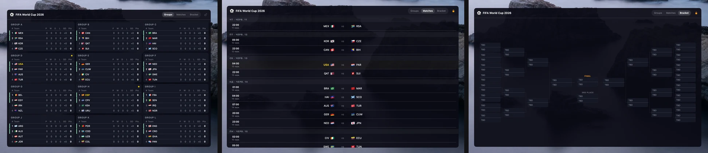

# Vuvuzela

[](https://github.com/bsnkhua/vuvuzela/actions/workflows/ci.yml)
[](https://github.com/bsnkhua/vuvuzela/releases)
[](LICENSE)

**Vuvuzela** is a lightweight macOS desktop widget for FIFA World Cup 2026 — live group standings, match schedule, and knockout bracket right on your desktop. A borderless window living at desktop level, above the wallpaper and below your app windows.



## Features

- **Groups** — live standings for all 12 groups with flags, points, goal difference
- **Matches** — full schedule grouped by day with team flags and kickoff times in your local timezone
- **Bracket** — knockout stage tree from Round of 32 to the Final
- Switch views with the Groups / Matches / Bracket buttons in the header
- Drag it anywhere on the desktop; position is remembered across launches
- 🔒 Lock icon pins the position
- Background opacity control (100 / 92 / 85 / 70 %)
- Launch at login toggle; no Dock icon
- Checks for updates every 6 hours and shows a banner in the menu bar when one is available

## Requirements

- macOS 14 Sonoma or later
- Swift 6 toolchain for building from source — Command Line Tools are enough (`xcode-select --install`), full Xcode is not required

## Install

### Direct download

Download the latest `Vuvuzela.dmg` from the [Releases page](https://github.com/bsnkhua/vuvuzela/releases), open it, drag **Vuvuzela** into Applications, and launch it.

The app is signed and notarized — Gatekeeper will not block it.

### Homebrew

```bash
brew install bsnkhua/tap/vuvuzela
```

The formula builds the widget from source on your machine (~30 s). Because the app is built locally, Gatekeeper has no objections to the unsigned bundle.

Quit any time from the menu bar ⚽ icon → **Quit Vuvuzela**.

### From source

```bash
git clone https://github.com/bsnkhua/vuvuzela.git
cd vuvuzela
make app
open "dist/Vuvuzela.app"   # or move it to /Applications
```

## Update

```bash
brew update && brew upgrade vuvuzela && (pkill -f "Vuvuzela.app"; sleep 1; open -a Vuvuzela)
```

Or download the latest DMG from the [Releases page](https://github.com/bsnkhua/vuvuzela/releases).

The widget also checks GitHub for new releases every 6 hours. When one is available, a banner appears in the menu bar.

## Uninstall

1. Toggle off **Launch at login** in the menu bar (if enabled) and quit the widget
2. Delete `Vuvuzela.app` from Applications
3. Remove saved preferences: `defaults delete com.bsnkhua.vuvuzela`

Via Homebrew: `brew uninstall vuvuzela`

## Build & test

```bash
make build      # debug build
make test       # run test suite
make app        # release .app bundle → dist/Vuvuzela.app
```

## License

MIT — see [LICENSE](LICENSE).
