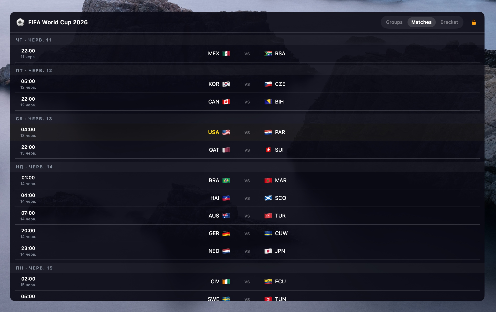
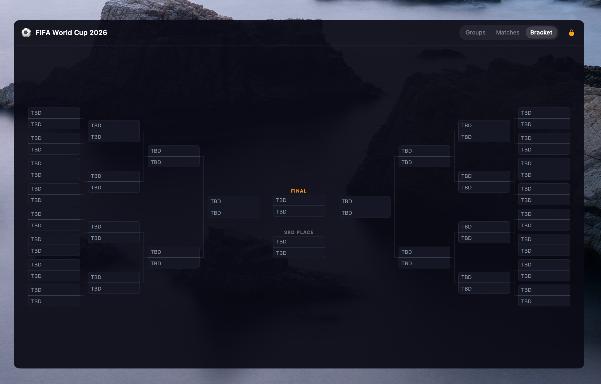

# Vuvuzela

[](https://github.com/bsnkhua/vuvuzela/actions/workflows/ci.yml)
[](https://github.com/bsnkhua/vuvuzela/releases)
[](LICENSE)
[](https://ko-fi.com/bsnkhua)

**Vuvuzela** is a lightweight macOS desktop widget for FIFA World Cup 2026. It sits on your desktop as a borderless window — above the wallpaper, below your app windows — showing live standings, the full match schedule, and the knockout bracket without ever leaving your workspace.


<table>
  <tr>
    <td width="50%"></td>
    <td width="50%"></td>
  </tr>
</table>

## Features

### Groups

All 12 groups at a glance — rank, team flag, P / W / D / L / GD / Pts. A color bar on the left edge of each row shows the team's current status: **green** for direct qualification (top 2), **teal** for best-third projection. The best-third calculation uses FIFA tiebreakers (points → goal difference → goals scored) across all groups, so you always see which eight rank-3 teams are currently advancing.

During live group-stage matches, standings update in real time — in-progress scores are projected onto the table, positions shift as goals are scored.

### Matches

Matches are split into three sections:

- **LIVE** — in-progress matches at the top with a pulsing dot, live minute, and current score
- **Upcoming** — grouped by day with TODAY / TOMORROW labels; kickoff times are in your local timezone
- **Results** — today's finished matches with the final score

Each row shows team flags, abbreviations, score (or kickoff time for scheduled matches), and the group or round tag. A halftime indicator (HT) appears during the break.

### Bracket

The full knockout tree from Round of 32 through to the Final, updated as results come in.

### Favourites & notifications

Tap any team in the Groups or Matches view to mark it as a favourite. Favourite teams are highlighted in yellow throughout the widget. Groups that contain a favourite show a ★ in their header.

Once a team is marked as favourite, Vuvuzela sends macOS system notifications:

- **Goal** — an alert with the scorer's flag and the live score, with a custom goal sound
- **Kick-off** — a notification when a match involving your team starts

Notifications only fire for teams you've explicitly starred.

### Widget controls

- **Drag** the widget anywhere on the desktop; position is remembered across launches
- **Resize** by dragging the right edge (720 – 1200 px wide)
- **Lock** icon in the header pins the position and disables resize
- **Opacity** — four background transparency levels: 100 / 92 / 85 / 70 %
- **Launch at login** toggle in the menu bar; no Dock icon, no interruptions

### Data refresh

The widget polls live automatically:

| Situation | Interval |
|-----------|----------|
| Match in progress | every 60 s |
| Next match starts in < 1 hour | every 5 min |
| No match imminent | every hour |

When a window is hidden behind other apps or the display is off, polling pauses and resumes immediately when the widget becomes visible again.

### Automatic updates

Vuvuzela checks for new releases every 24 hours via Sparkle. When an update is available, a banner appears in the menu bar — no action required to stay current.

## Requirements

- macOS 14 Sonoma or later
- Swift 6 toolchain for building from source — Command Line Tools are enough (`xcode-select --install`), full Xcode is not required

## Install

### Direct download

Download the latest `Vuvuzela.dmg` from the [Releases page](https://github.com/bsnkhua/vuvuzela/releases), open it, drag **Vuvuzela** into Applications, and launch it.

The app is signed and notarized — Gatekeeper will not block it.

### Homebrew

```bash
brew install bsnkhua/tap/vuvuzela
```

The formula builds the widget from source on your machine (~30 s). Because the app is built locally, Gatekeeper has no objections to the unsigned bundle.

### From source

```bash
git clone https://github.com/bsnkhua/vuvuzela.git
cd vuvuzela
make app
open "dist/Vuvuzela.app"   # or move it to /Applications
```

Quit any time from the menu bar icon → **Quit Vuvuzela**.

## Update

The widget updates itself automatically. To update the Homebrew installation manually:

```bash
brew update && brew upgrade vuvuzela && (pkill -f "Vuvuzela.app"; sleep 1; open -a Vuvuzela)
```

Or download the latest DMG from the [Releases page](https://github.com/bsnkhua/vuvuzela/releases).

## Uninstall

1. Toggle off **Launch at login** in the menu bar (if enabled) and quit the widget
2. Delete `Vuvuzela.app` from Applications
3. Remove saved preferences: `defaults delete com.bsnkhua.vuvuzela`

Via Homebrew: `brew uninstall vuvuzela`

## Build & test

```bash
make build      # debug build
make test       # run test suite
make app        # release .app bundle → dist/Vuvuzela.app
```

## License

MIT — see [LICENSE](LICENSE).
